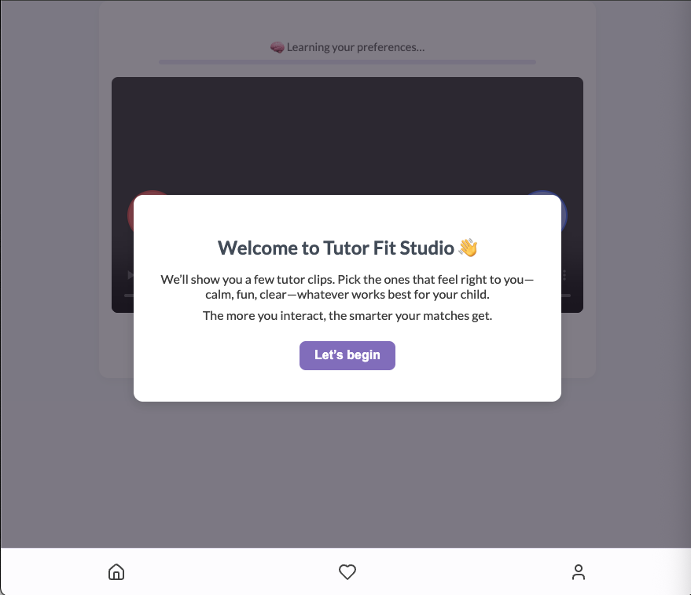
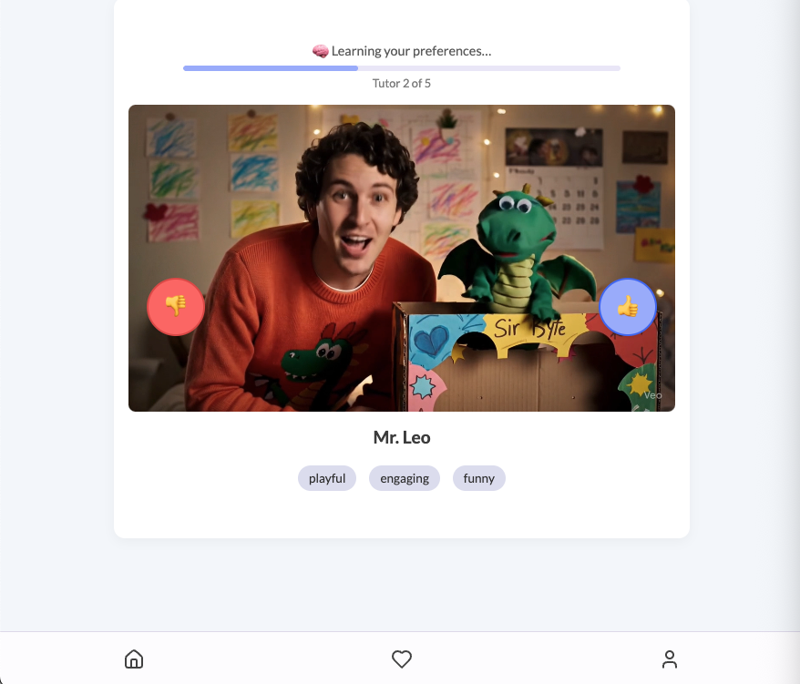
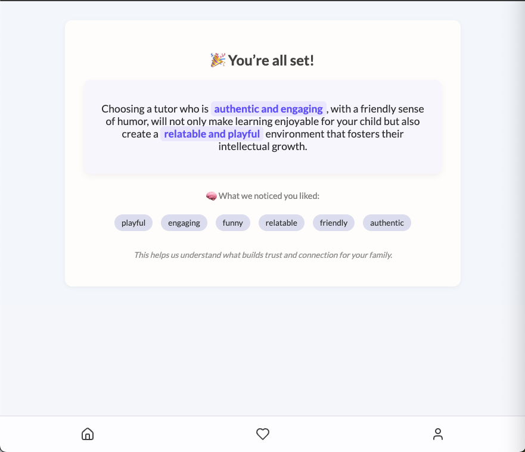

# Tutor Fit Studio – AI-Powered Trust Prototype 🧠✨

Tutor Fit Studio is a lightweight, interactive prototype designed to explore how AI can build *felt trust* between families and tutors during onboarding. It’s part of a broader exploration of how dynamic trust systems can increase conversion for high-consideration education platforms.

## 🎯 Features

- **Swipe Through Tutor Clips** – Like 👍 or dislike 👎 tutor videos featuring different personality traits  
- **Trust Loop Visuals** – A dynamic progress bar and tutor counter (e.g. “Tutor 2 of 5”) make the onboarding experience feel active and transparent  
- **Trust Profile** – User feedback builds a simple weighting over traits  
- **OpenAI GPT‑4 Summary** – Generates a one-sentence, heartfelt summary that:
  - Highlights key emotionally resonant phrases
  - Includes inline text highlighting
- **Final UI** – Lilac summary box, trait pills, and spinner while AI is processing  

---

## 🧠 Concepts Behind the Prototype

This prototype draws on ideas from:

- **Human-AI Collaboration** — Using tone and subtle UI feedback to convey emotional intelligence
- **Trust Loop Design** — Visualizing real-time feedback to make the system feel active and attuned
- **Dynamic Trait Graphs** — Matching tutors based on soft signals, not just structured filters

---

## 🛠️ Tech Stack

- **Frontend** – Lightweight vanilla **HTML**, **CSS**, **JavaScript**  
- **Backend** – `server.js` using **Express** to serve static files and provide an `/api/gpt-summary` endpoint  
- **AI Integration** – OpenAI GPT‑4 for trait-based summary generation  
- **Deployment** – Hosted on **Replit**, autoscaled Node.js server  

---

## 📂 Repository Structure
```
/
├─ public/
│  ├─ calm.mov               │ Sample calm tutor video
│  ├─ playful.mov            │ Sample playful tutor video
│  ├─ index.html             │ Core UI: video area, progress bar, summary box
│  ├─ script.js              │ Client-side logic: swipe handling, trait capture, GPT call
│  ├─ style.css              │ Custom styling: layout, pill design, spinner, lilac theme
│  └─ tutors.json            │ Sample tutor objects with traits and media URLs
├─ screenshots/
│  ├─ starting-screen.png    │ Preview of onboarding screen
│  ├─ swipe-interface.png    │ Preview of swipe UI
│  └─ summary-screen.png     │ Preview of final trust summary view
├─ server.js                 │ Express server with GPT summary route
├─ .env                      │ (Not included in repo) OpenAI API key stored here
├─ .gitignore                │ Ignores .env, node_modules, system files
├─ package.json              │ Dependencies and scripts
└─ README.md                 │ Project overview and local setup instructions
```

---

## ⚙️ Setup & Run Locally

1. **Clone the repository**  
   ```bash
   git clone https://github.com/ashwinma14/tutor-fit-studio-prototype-v2.git
   cd tutor-fit-studio-prototype-v2
   ```
2. **Install dependencies**  
   ```bash
   npm install
   ```
3. **Add your OpenAI key** by creating a `.env` file with:  
   ```
   OPENAI_API_KEY=your-openai-api-key-here
   ```
4. **Start the server**  
   ```bash
   node server.js
   ```
5. **Open your browser** at `http://localhost:3000`

---

## 🎥 Demo Preview

Here’s a sneak peek at how the prototype works:

### Welcome Screen



### Trait Selection & Swiping



### Personalized Summary



---

## 📬 Questions?

Feel free to reach out if you're curious about the design decisions, implementation, or want to explore ideas around emotionally intelligent AI interfaces!
